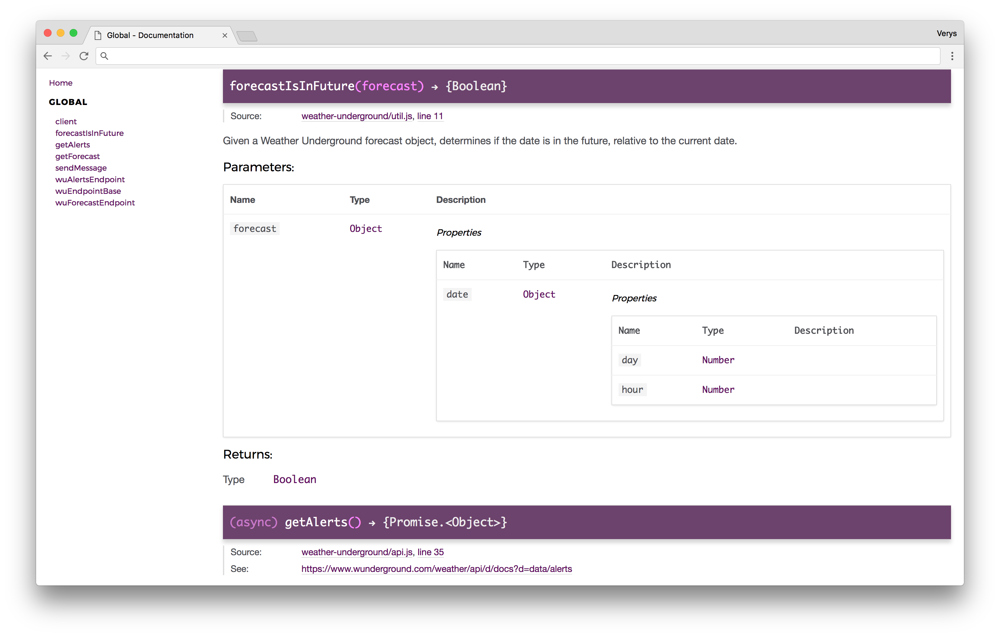

# Raspberry Pi Weather Alerts
Twilio and Weather Underground integration to send SMS weather notifications

[](https://travis-ci.org/john-goldsmith/rpi-wind-alerts)
[](https://codeclimate.com/github/john-goldsmith/rpi-wind-alerts/maintainability)
[](https://codeclimate.com/github/john-goldsmith/rpi-wind-alerts/test_coverage)
[](https://coveralls.io/github/john-goldsmith/rpi-wind-alerts?branch=master)
[](https://david-dm.org/john-goldsmith/rpi-wind-alerts)

## Tests

`npm test`

```
41 passing
1 pending

-------------------------|----------|----------|----------|----------|-------------------|
File                     |  % Stmts | % Branch |  % Funcs |  % Lines | Uncovered Line #s |
-------------------------|----------|----------|----------|----------|-------------------|
All files                |      100 |      100 |      100 |      100 |                   |
 src                     |      100 |      100 |      100 |      100 |                   |
  config.js              |      100 |      100 |      100 |      100 |                   |
 src/twilio              |      100 |      100 |      100 |      100 |                   |
  api.js                 |      100 |      100 |      100 |      100 |                   |
  client.js              |      100 |      100 |      100 |      100 |                   |
 src/weather-underground |      100 |      100 |      100 |      100 |                   |
  alert-types.js         |      100 |      100 |      100 |      100 |                   |
  api.js                 |      100 |      100 |      100 |      100 |                   |
  util.js                |      100 |      100 |      100 |      100 |                   |
-------------------------|----------|----------|----------|----------|-------------------|
```

## Documentation

`npm run docs`



## Linting
Refer to the [ESLint docs](https://eslint.org/docs/rules/) and [.eslintrc.json](./.eslintrc.json) for rules.

`npm run lint`

## To Do
- [ ] Flag each forecast condition when met to limit notifications to the next soonest occurrence
- [ ] Integration tests
